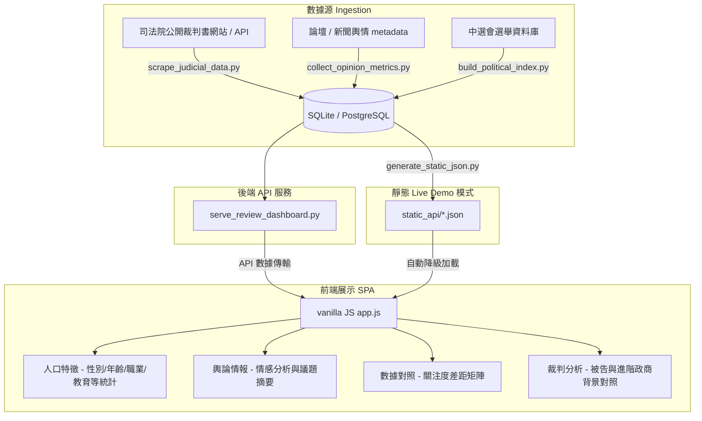

# Public Safety and Judicial Justice Visualization (公眾治安與司法正義檢視網)

💡 **以數據為基石，探索官方司法裁判人口特徵與公眾輿論聲量之間的維度偏差與聚焦關聯。**

🔗 [**Live Demo**](https://public-safety-integrity-analytics.vercel.app/#overview)

---

## 專案簡介 (Overview)

本專案是一個**數據整合與對照儀表板平台**。其宗旨非重建或儲存海量的裁判書全文庫，而是透過自動化數據管道（Data Pipeline）進行輕量、動態的網頁爬蟲與數據解析，提取並對照兩大核心維度：

1. **司法裁判與人口特徵數據 (Judicial Rulings & Demographics)**：動態爬取司法機關近期公開之裁判書內文，利用規則與特徵分析技術，解析並統計涉案人員的人口與社會學特徵，包含**年齡 (Age)**、**性別 (Gender)**、**收入/財產狀況 (Income)**、**出生地/戶籍地 (Birth-City)**、**職業 (Occupation)** 及 **教育程度 (Education-Level)**，提供大眾化的量化統計與視覺化圖表。
2. **輿論聲量指標 (Public Opinion Metrics)**：以符合爬蟲規範（Robots.txt）之方式抓取社群論壇（如 PTT、Dcard）、新聞及司法評論之元數據，計算討論聲量與情緒標籤，呈現公眾對於司法案件與各類議題之關注趨勢。

藉由將兩者置於同一時間軸，平台能以量化圖表與對照矩陣，客觀呈現司法判決趨勢與公眾對於各類型犯罪（如詐欺、傷害等）的**關注度落差 (Attention Gaps)**。

*   **進階特色 (Advanced Feature)**：將裁判書被告名單與中央選舉委員會（CEC）選舉資料庫進行交叉比對，探索特定案件的政商與政黨背景（例如貪瀆、賄選、選罷法案件等）。

---

## 系統架構與資料流 (Architecture & Data Flow)

本專案採用輕量、高性能且易於部署的技術架構：

*   **前端展示**：採用 Vanilla HTML / CSS / JavaScript 打造單頁應用程式 (SPA)，具備現代化高密度數據儀表板視覺風格、毛玻璃光影效果與全響應式設計。
*   **後端服務**：由 Python 提供資料爬取、解析與 API 服務，支援 SQLite 本地開發模式與 PostgreSQL / Supabase 雲端生產模式。
*   **數據排程**：每日定時啟動輕量爬蟲與解析管道，僅針對新增的相關裁判書進行精確欄位提取。



---

## 技術亮點 (Technical Highlights)

1.  **結構化司法人口特徵提取**
    透過網頁爬蟲取得裁判書內文後，利用特定規則與正則表達式（Regex），從被告宣告段落精確提取年齡、性別、職業、教育程度、收入背景等欄位，將非結構化判決文字轉化為具公共價值的量化數據。
2.  **進階政黨與選舉背景比對 (未來計畫)**
    對接中選會開放資料庫，將貪污、瀆職、賄選等公務人員犯罪被告與歷屆參選人名冊進行比對，呈現犯罪案件的政治光譜與結構分析。
3.  **無後端靜態 Live Demo 降級方案**
    前端 `app.js` 具備自適應偵測機制。當專案部署於靜態託管平台、或本地後端伺服器未啟動時，會自動改為載入 `static_api/` 目錄中預先匯出的 JSON 資料，並在前端以記憶體內（In-Memory）過濾與分頁技術實現無縫的數據檢索與圖表互動。

---

## 本地執行指南 (Local Setup Guide)

### 方式一：Windows 一鍵啟動 (推薦)

在專案根目錄下直接點擊執行：
```bat
run.bat
```
在隨後出現的選單中：
*   輸入 `1` 即可啟動本地 Web 伺服器並載入 SQLite 資料庫。
*   開啟瀏覽器訪問 `http://127.0.0.1:8765` 即可使用完整功能。
*   輸入 `2` 可手動啟動司法院裁判爬取與輿情生成管道。

### 方式二：手動啟動

1.  **安裝依賴與初始化資料庫**
    專案主要使用 Python 3 標準庫與輕量爬蟲。若需執行後端 API，可直接執行：
    ```bash
    # 初始化資料庫並抓取最新裁判數據與輿論聲量
    python scripts/run_daily_update.py
    ```

2.  **開啟本地 Web Server**
    ```bash
    python scripts/serve_review_dashboard.py --db data/local/public_safety.sqlite
    ```
    伺服器啟動後，訪問 `http://127.0.0.1:8765`。

3.  **生成靜態 Demo 資料** (若欲進行靜態部署)
    ```bash
    python scripts/generate_static_json.py
    ```
    該指令會將資料庫中的統計與裁判明細匯出至 `web/static_api/` 中。

---

## 目錄結構 (Directory Structure)

```text
Public-Safety-Integrity-Analytics/
├── config/                      # 系統與案類權重配置
├── data/
│   └── local/                   # 本地 SQLite 資料庫 (public_safety.sqlite)
├── output/
│   └── official_statistics/     # 歷史下載的官方統計 JSON 快照
├── sql/
│   ├── schema_sqlite.sql        # SQLite 資料表結構
│   └── schema_postgres.sql      # PostgreSQL / Supabase 資料表結構
├── scripts/
│   ├── run_daily_update.py      # 統一數據排程抓取主腳本
│   ├── serve_review_dashboard.py# 本地 Python API 伺服器
│   ├── generate_static_json.py  # 匯出靜態展示 API 檔腳本
│   └── scrape_judicial_data.py  # 司法判決爬蟲與人口特徵提取腳本 (取代舊的 build_judgment_index.py)
├── web/                         # 前端 SPA 網頁資源
│   ├── static_api/              # 靜態降級 API JSON 目錄
│   ├── index.html               # 儀表板 HTML 頁面
│   ├── styles.css               # 數據密集儀表板 CSS
│   └── app.js                   # 前端路由與數據處理邏輯
├── run.bat                      # Windows 一鍵啟動腳本
└── README.md                    # 本說明文件
```

---

## 授權說明 (License)

本專案僅供學術探討、個人職涯作品集展示與技術驗證使用。請勿將其產出的輿情聲量模擬或預算數據直接引用為司法不公或犯罪現狀之實體結論。\n
