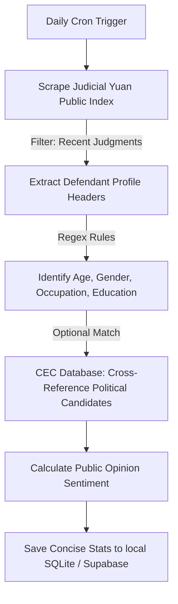

# Public Safety & Integrity Data Source Assessment

Date: 2026-06-23

## Summary

The project prioritizes targeted, dynamic web scraping and concise query-based daily updates over heavy bulk dataset warehousing. By scraping the Judicial Yuan public search system for recent court judgments, we extract core public demographics (Age, Gender, Income, Birth-City, Occupation, Education-Level). We also prepare for a phased integration with the Central Election Commission (CEC) database to cross-reference case defendants for political/party backgrounds as an advanced future feature.

## Primary Sources

### 1. Judicial Yuan Court Judgments (Scraping & Targeted Ingestion)

- **Search Portal:** `https://judgment.judicial.gov.tw/`
- **Open Data Portal:** `https://opendata.judicial.gov.tw/`
- **Methodology:** Scraping recent daily judgments via HTTP queries/Playwright. By querying recent dates and specific crime types (e.g., fraud, violent crimes, or political corruption/bribery), we download only the HTML/metadata of relevant judgments instead of multi-gigabyte monthly RAR archives.
- **Demographic Extraction Columns:**
  - **Age (年齡):** Extracted using regex patterns from the defendant description header (e.g., `民國XX年生` or `XX歲`).
  - **Gender (性別):** Extracted from keywords like `男` or `女`.
  - **Income (收入/經濟狀況):** Extracted from sentencing factors mentioning financial conditions (e.g., `家庭經濟狀況勉可維持`, `家庭生活狀況貧寒`).
  - **Birth-City (出生地/戶籍地):** Parsed from defendant's registered address details or birth notes.
  - **Occupation (職業):** Extracted from headers or context details (e.g., `職業為臨時工`, `從事餐飲業`).
  - **Education-Level (教育程度):** Extracted from sentencing factors regarding education (e.g., `國中畢業`, `大學肄業`).
- **Automation Fit:** High for daily, lightweight incremental routine scrapes. Low-cost and suitable for local/free-tier hosting.

### 2. Central Election Commission (CEC) Election Database (Advanced Phase)

- **Portal:** `https://db.cec.gov.tw/ElecTable`
- **Data Formats:** Static JSON databases of political parties, candidates, and elected candidates (e.g., `ELC_L0.json`).
- **Integration Objective:** Once the defendant name is parsed, check if it matches a candidate or elected officer name in the CEC database within the same constituency. This allows automatic party-affiliation labeling (e.g., KMT, DPP, TPP, Independent) to trace the political backgrounds of crimes.
- **Automation Fit:** High. The dataset is static/slow-changing, so we only need to sync candidate lists after major elections.

### 3. Ministry of the Interior / National Police Crime Statistics (Secondary Context)

- **Source:** Government Data Open Platform dataset `9603`, "受(處)理刑事案件發生件數-按機關別分"
- **Access:** No account required, CSV format.
- **Use Case:** Used only as a secondary context to compare official incident counts against actual court judgment statistics and public attention, highlighting coverage/attention gaps.

## Scraping vs Bulk Download

| Metric | Targeted Web Scraping (Current) | Bulk RAR Download (Legacy) |
| --- | --- | --- |
| **Storage Overhead** | Very Low (< 50 MB total SQLite DB) | High (> 7 GiB/year uncompressed JSON) |
| **Credentials Required** | None (public web search) | Yes (portal account for member datasets) |
| **Processing Delay** | Near Real-time (Daily routine checks) | Monthly (RARs released weeks late) |
| **Scope of Data** | Concise (Only matched cases & metrics) | Massive (All civil, criminal, administrative documents) |

## Recommended Daily Routine Ingestion Flow

## Key Limitations & Guardrails

1. **Name Collision in CEC Matching:** Common names will match multiple candidates. We must implement a heuristic matching algorithm (checking region, county, age, and case context) and mark high-confidence political matches clearly.
2. **Text Variability:** Defendant profiles in judgments are written in natural Chinese text. Regular expressions must be robust and degrade gracefully (setting values to `unknown`) when a demographic attribute cannot be parsed with certainty.
3. **Scraping Limits:** Respect the Judicial Yuan server rules, implement crawl delays (throttling), and avoid aggressive multi-threaded hits.\n